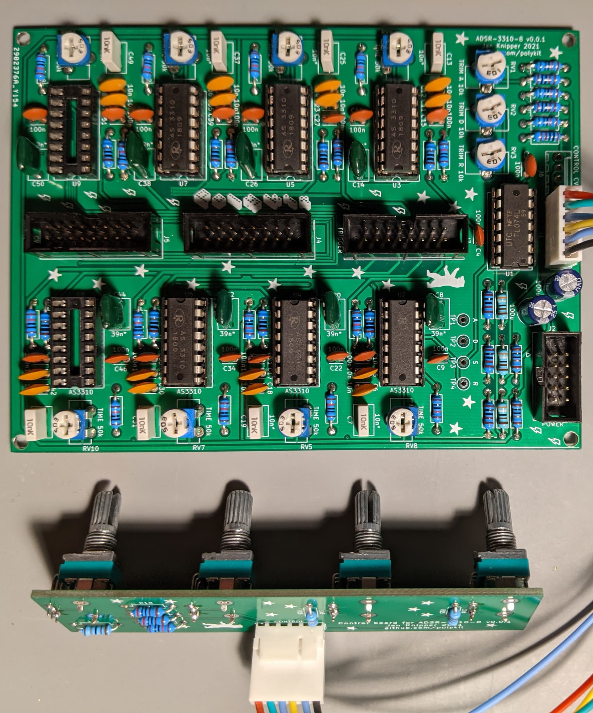

# Polykit ADSR-3310-8

Here you can find Kicad schematics and PCB layout for an 8 channel ADSR based on the CEM3310/AS3310 integrated circuit. It has a separate control board for all 4 parameters and offers gate and trigger input and CV output. Power is supplied by standard +12V/-12V Eurorack connector.

## References

https://www.synthxl.com/wp-content/uploads/2018/04/Crumar-Trilogy-Schematic.pdf#page=13

https://www.vintagesynthparts.com/wp-content/uploads/2016/08/Crumar-Stratus-Service-Manual.pdf#page=14

http://www.muzines.co.uk/articles/electro-music-engineer-cem-3310/3647

https://www.alfarzpp.lv/eng/sc/AS3310.pdf

https://datasheetspdf.com/pdf-file/104287/ETC/CEM3310/1
